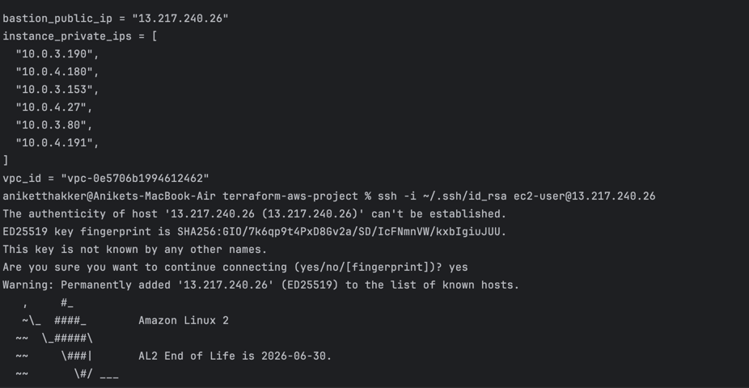
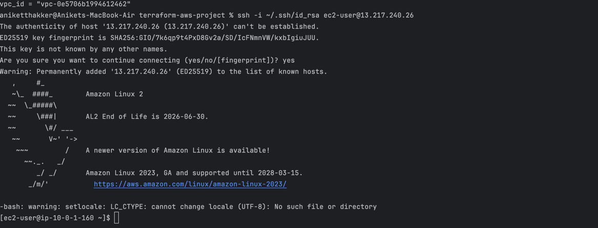
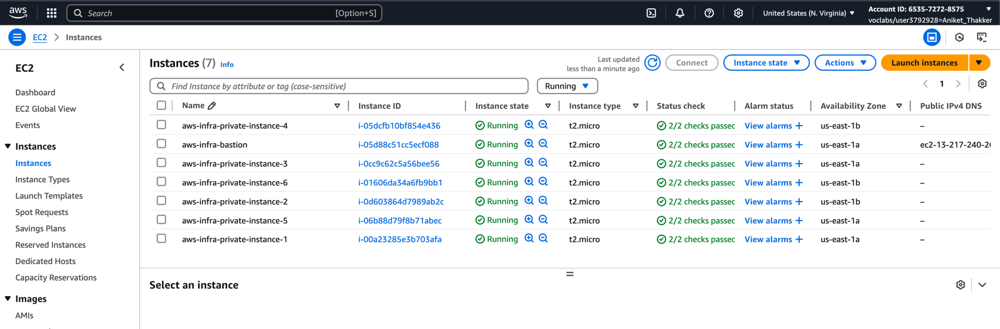
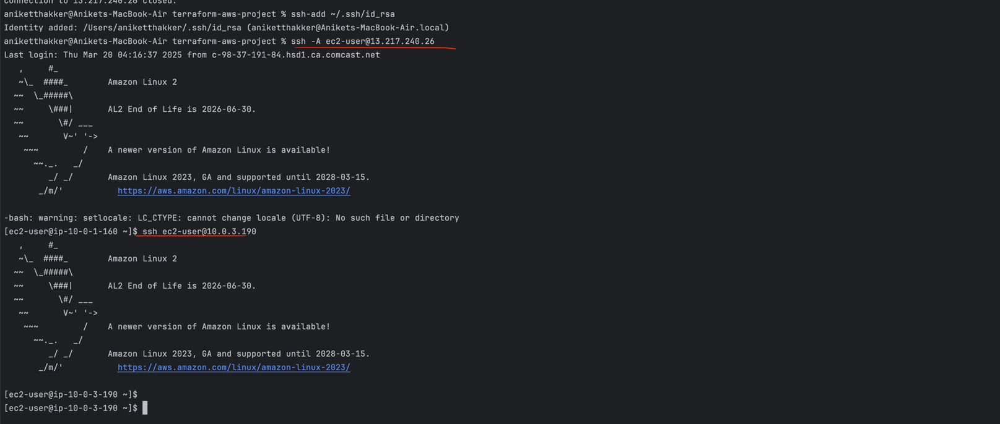

# FINAL OUTPUT

- List of our ips\
  

- Login into the bastian host using our own personal ssh key

- AWS Console EC2 Verification
 

  
- Login to private subnet IPs through our public ip server
- First login to Bastian Host then through Bastion Host Log in to the private subnet ips

## NOTE: THE RSA SSH-KEY CREATED WHEN BUILDING AMI THROUGH PACKER IS REQUIRED

## Configure:
-   ### Step 1: Your public rsa key.
    - In the main.tf in the root folder
    - Search for  **YOUR_PUBLIC_KEY_HERE**  and replace it with the same key used to create the AMI.

- ### Step 2 : IP Address:
  - In the file terraform.tfvars
  - Enter your IP Address and append /32 to it.

- ### Step 3 : Run
  > terraform init 
  > terraform plan
  > terraform apply

- ### Step 4: Verify Output
   >  bastion_public_ip = "13.XXX.XX.26" \
    instance_private_ips = [\
    "10.0.3.XXX", \
    "10.0.4.XXX",\
    "10.0.3.XXX",\
    "10.0.4.XX",\
    "10.0.3.XX",\
    "10.0.4.XXX",\
    ]\
    vpc_id = "vpc-XXXX06b1994612462" 

- ### SSH Into the bastion/public ec2 using the PRIVATE key 
    > ssh -i **PRIVATE KEY PATH** ec2-user@**BASTION IP**
  - #### Once loged in to bastion/publiv server you just need to ssh into private subnet
    > ssh ec2-user@**PRIVATE IP**
  
    - #### Known Problems
      - Might face permission denied to login into the private ip through bastion
      - To fix it logout of the bastion ec2 and then run
        > ssh-add ~/.ssh/id_rsa \
         ssh -A ec2-user@**BASTION IP**
      
